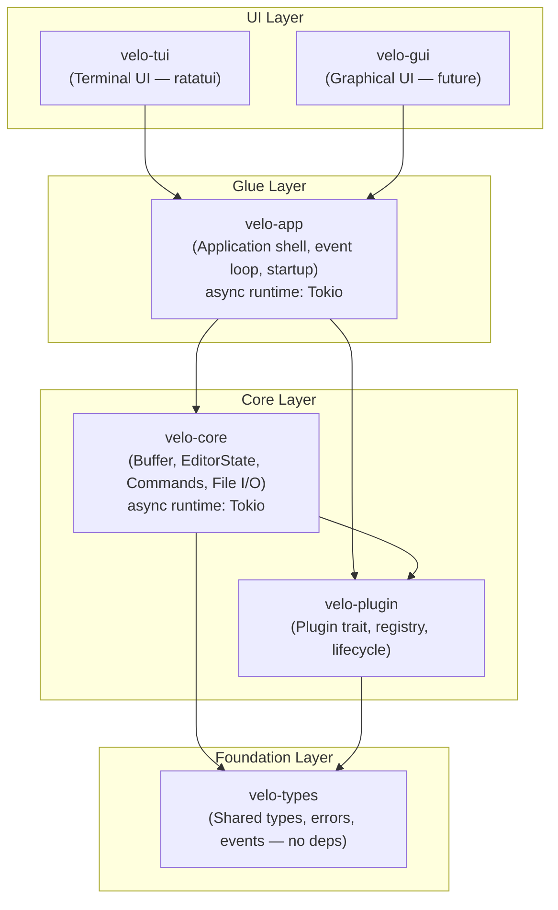
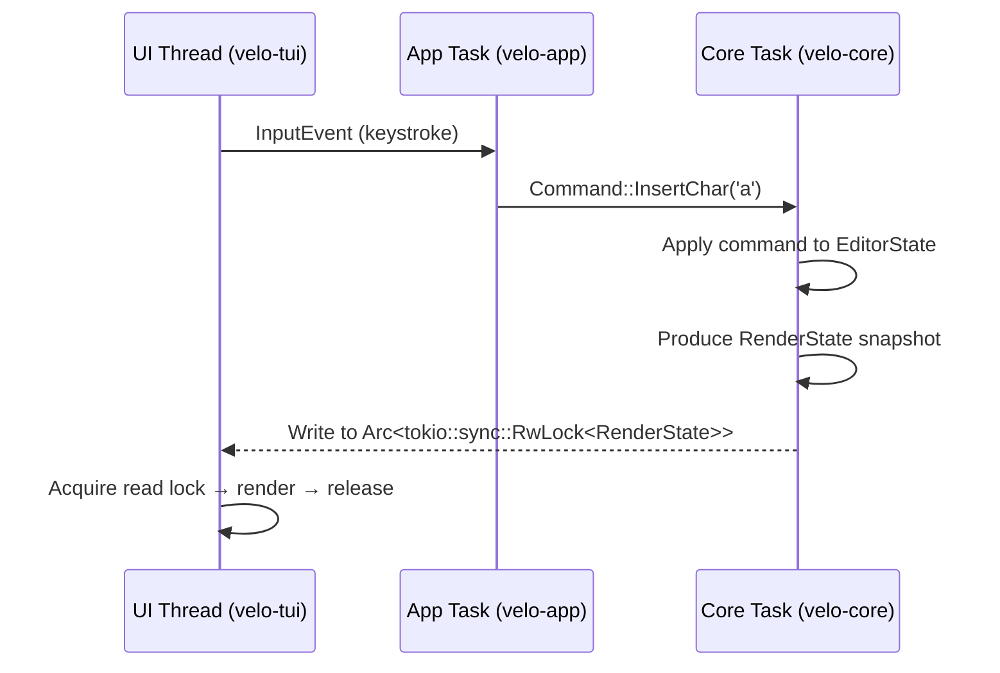
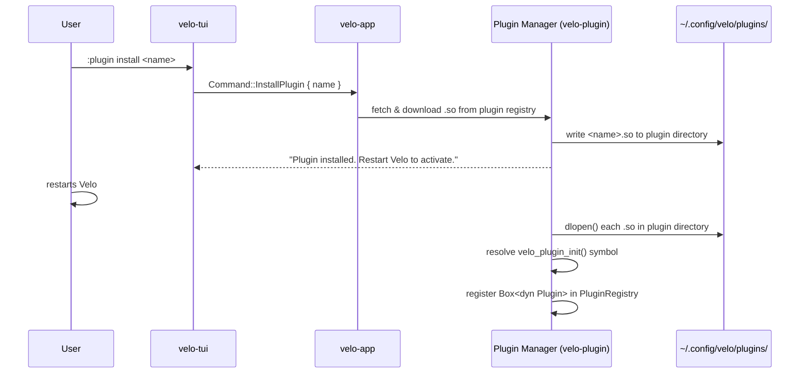
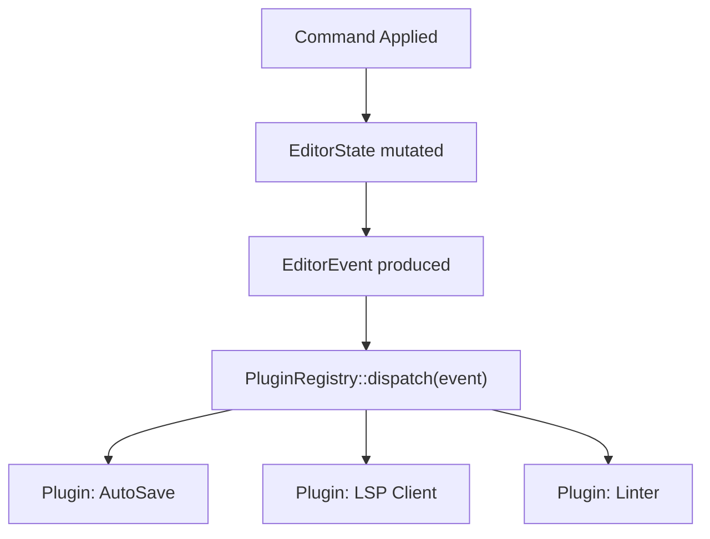
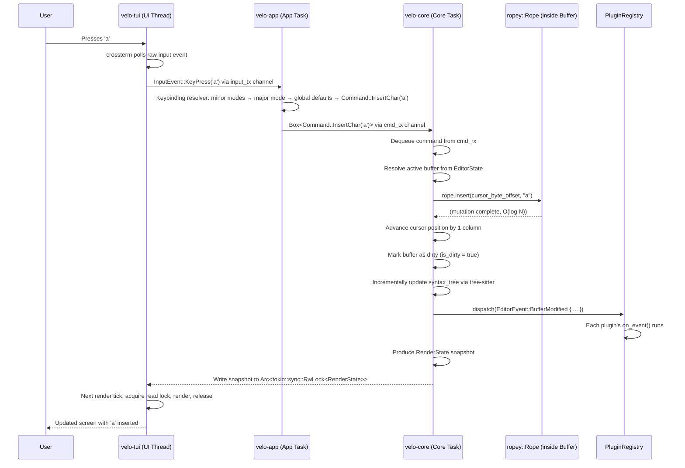

# Design Document: velo

## Overview

Velo is a high-performance, "post-modern" all-purpose text editor written in Rust, built on a strictly decoupled workspace architecture. The editor separates all core logic (buffer management, file I/O, indexing, plugin execution) from UI concerns, enabling both a Terminal UI (TUI) and a Graphical UI (GUI) frontend to coexist over the same core. The system is multi-threaded by design: the UI thread is never blocked by heavy operations, and an extension framework allows plugins to hook into editor lifecycle events.

---

## 1. Crate Graph & Workspace Structure

The project is a Cargo workspace named `velo`. Each crate has a single, well-defined responsibility. Dependency arrows point from consumer to provider — the core crates have zero knowledge of UI crates.



### Crate Responsibilities

| Crate | Responsibility |
|---|---|
| `velo-types` | Shared primitives: `Position`, `Range`, `EditorEvent`, `VeloError`. Zero external deps. |
| `velo-core` | Buffer management via `ropey`, `EditorState`, command execution, file I/O, background task dispatch. |
| `velo-plugin` | `Plugin` trait definition, plugin registry, event dispatch to plugins. |
| `velo-app` | Owns the Tokio event loop, bridges UI input events to core commands, owns channels. |
| `velo-tui` | Renders state snapshots to the terminal using `ratatui`. Sends raw input events to `velo-app`. |
| `velo-gui` | Future graphical frontend. Same contract as `velo-tui` — consumes `velo-app` only. |

---

## 2. Core API Design

### 2.1 Primary Data Structures

#### Buffer

```
Buffer
├── rope: ropey::Rope                       — the actual text content
├── file_path: Option<PathBuf>              — None for unsaved buffers
├── is_dirty: bool                          — modified since last save
├── cursor: Position                        — (line, column) of the primary cursor
├── selections: Vec<Selection>              — multi-cursor / selection ranges
├── major_mode: Box<dyn MajorMode>          — active major mode for this buffer
├── minor_modes: Vec<Box<dyn MinorMode>>    — active minor modes for this buffer
└── syntax_tree: Option<tree_sitter::Tree>  — incremental tree-sitter parse tree
```

#### EditorState

`EditorState` is the top-level owned state of `velo-core`. It is the single source of truth.

```
EditorState
├── buffers: Vec<Buffer>              — all open buffers
├── active_buffer_id: usize           — index into buffers
├── config: VeloConfig                — keybindings, theme, tab size, etc.
├── major_mode_registry: MajorModeRegistry  — all registered major modes (built-in + plugin-provided)
└── plugin_registry: PluginRegistry
```

#### MajorMode & MinorMode (in `velo-core`)

Velo uses an Emacs-inspired mode system. There is no global editing mode — the editor is always "in insert" in the traditional sense. Behavior is instead shaped by per-buffer major modes and stackable minor modes.

**Major Mode** — exactly one per buffer. Set automatically by file type detection (e.g., `.rs` → `RustMode`) or manually by the user. Defines:
- The tree-sitter grammar to use for syntax highlighting
- Indentation rules
- A base keybinding layer specific to the file type
- Language-specific commands (e.g., `format buffer`, `run tests`)

Plugins can register new major modes via `MajorModeRegistry::register()` at startup.

```
Trait: MajorMode
  fn name(&self) -> &str                          — e.g. "rust", "markdown"
  fn file_patterns(&self) -> &[&str]              — e.g. ["*.rs"]
  fn grammar(&self) -> Option<&tree_sitter::Language>
  fn indent_style(&self) -> IndentStyle
  fn keybindings(&self) -> KeybindingMap
```

**Minor Mode** — zero or more per buffer, or applied globally. Stackable, orthogonal layers that add or override behavior without replacing the major mode. Minor modes are implemented as plugins.

```
Trait: MinorMode  (extends Plugin)
  fn name(&self) -> &str
  fn keybindings(&self) -> KeybindingMap   — merged on top of major mode bindings
  fn on_activate(&mut self, buffer_id: usize, state: &mut EditorState)
  fn on_deactivate(&mut self, buffer_id: usize, state: &mut EditorState)
```

**Keybinding resolution order** (in `velo-app`):
1. Active minor modes (last activated wins)
2. Active major mode
3. Global default bindings from `VeloConfig`

#### Buffer (updated)

```
Buffer
├── rope: ropey::Rope                       — the actual text content
├── file_path: Option<PathBuf>              — None for unsaved buffers
├── is_dirty: bool                          — modified since last save
├── cursor: Position                        — (line, column) of the primary cursor
├── selections: Vec<Selection>              — multi-cursor / selection ranges
├── major_mode: Box<dyn MajorMode>          — active major mode for this buffer
├── minor_modes: Vec<Box<dyn MinorMode>>    — active minor modes for this buffer
└── syntax_tree: Option<tree_sitter::Tree>  — incremental tree-sitter parse tree
```

#### Position & Range (in `velo-types`)

```
Position  { line: usize, column: usize }
Range     { start: Position, end: Position }
Selection { anchor: Position, head: Position }
```

### 2.2 Core Traits

#### Command

Every user action is modeled as a `Command`. Commands are the only way to mutate `EditorState`. This enforces a unidirectional data flow and makes undo/redo straightforward.

```
Trait: Command
  fn execute(&self, state: &mut EditorState) -> Result<(), VeloError>
  fn undo(&self, state: &mut EditorState) -> Result<(), VeloError>  [optional]
  fn name(&self) -> &str
```

Example commands: `InsertChar`, `DeleteChar`, `MoveCursor`, `SaveFile`, `OpenFile`.

#### Plugin (see Section 4)

```
Trait: Plugin
  fn name(&self) -> &str
  fn on_event(&mut self, event: &EditorEvent, state: &mut EditorState)
```

---

## 3. Concurrency & Synchronization Model

The UI must never block. All heavy work (file loading, regex search, indexing) runs on background tasks. The architecture uses **message passing via channels** as the primary communication mechanism, with a read-only state snapshot shared to the UI for rendering. The async runtime is **Tokio** throughout — `tokio::spawn` for task spawning, `tokio::sync::mpsc` for channels, and `tokio::sync::RwLock` for shared state.

### 3.1 Thread Model

```mermaid
graph LR
    subgraph UI Thread
        UI["velo-tui<br/>Render loop<br/>Input polling"]
    end

    subgraph Tokio Runtime (velo-app / velo-core)
        APP["velo-app<br/>Event loop<br/>Command dispatch"]
        CORE["velo-core<br/>EditorState<br/>Command execution<br/>Plugin dispatch"]
        W1["tokio::spawn<br/>(file I/O)"]
        W2["tokio::spawn<br/>(regex / search)"]
        W3["tokio::spawn<br/>(indexing)"]
    end

    UI -- "InputEvent (tokio::sync::mpsc)" --> APP
    APP -- "Command (tokio::sync::mpsc)" --> CORE
    CORE -- "StateSnapshot (Arc<tokio::sync::RwLock>)" --> UI
    CORE -- "BackgroundTask (tokio::sync::mpsc)" --> W1
    CORE -- "BackgroundTask (tokio::sync::mpsc)" --> W2
    CORE -- "BackgroundTask (tokio::sync::mpsc)" --> W3
    W1 -- "TaskResult (tokio::sync::mpsc)" --> CORE
    W2 -- "TaskResult (tokio::sync::mpsc)" --> CORE
    W3 -- "TaskResult (tokio::sync::mpsc)" --> CORE
```

### 3.2 Channel Topology

| Channel | Direction | Type | Purpose |
|---|---|---|---|
| `input_tx / input_rx` | UI → App | `InputEvent` | Raw keystrokes, mouse events |
| `cmd_tx / cmd_rx` | App → Core | `Box<dyn Command>` | Translated commands |
| `task_tx / task_rx` | Core → Workers | `BackgroundTask` | Offloaded heavy work |
| `result_tx / result_rx` | Workers → Core | `TaskResult` | Completed work results |

All channels are `tokio::sync::mpsc` (bounded). Shared render state uses `Arc<tokio::sync::RwLock<RenderState>>`.

### 3.3 State Sharing for Rendering

`EditorState` is owned exclusively by the Core task. The UI does **not** share a lock on the live state. Instead, after each command is applied, the Core produces a lightweight `RenderState` snapshot and publishes it via an `Arc<tokio::sync::RwLock<RenderState>>`. The UI thread acquires a read lock only to render, then releases it immediately. This means:

- The Core task is never blocked by the UI rendering.
- The UI thread is never blocked waiting for a command to finish.
- There is no risk of deadlock between UI and Core.



### 3.4 Backpressure

The `cmd_tx` channel is bounded (`tokio::sync::mpsc`). If the Core task falls behind (e.g., during a large file load), the App task will apply backpressure rather than unboundedly queuing commands. The UI remains responsive because input polling and rendering are decoupled from command processing.

---

## 4. Extension Architecture

### 4.1 Dynamic Native Plugins via `libloading`

Velo's plugin system is Rust-only, forever. Plugins are distributed as pre-compiled native shared libraries (`.so` on Linux, `.dylib` on macOS, `.dll` on Windows) and loaded at startup via the `libloading` crate. This gives native performance with no FFI overhead beyond the initial `dlopen`.

**Plugin installation flow:**



**Plugin directory**: `~/.config/velo/plugins/`  
**Entry point symbol**: every plugin `.so` must export `fn velo_plugin_init() -> Box<dyn Plugin>`  
**Activation**: plugins are loaded once at startup — restart required after install/uninstall

### 4.2 Plugin Trait & Lifecycle

```
Plugin Lifecycle:
  1. Discovery     — velo-plugin scans ~/.config/velo/plugins/ at startup
  2. Loading       — libloading dlopen()s each .so and resolves velo_plugin_init()
  3. Registration  — returned Box<dyn Plugin> is added to PluginRegistry
  4. Initialization — on_load() called once with read access to VeloConfig
  5. Event Dispatch — on_event() called for each EditorEvent the plugin subscribes to
  6. Teardown       — on_unload() called on editor exit
```

### 4.3 EditorEvent Taxonomy

Events are defined in `velo-types` and are the only interface between the core and plugins.

```
EditorEvent
├── BufferEvents
│   ├── BufferOpened   { buffer_id: usize, path: Option<PathBuf> }
│   ├── BufferClosed   { buffer_id: usize }
│   ├── BufferModified { buffer_id: usize, change: BufferChange }
│   └── BufferSaved    { buffer_id: usize, path: PathBuf }
├── CursorEvents
│   ├── CursorMoved       { buffer_id: usize, new_pos: Position }
│   └── SelectionChanged  { buffer_id: usize, selection: Selection }
├── EditorEvents
│   ├── VeloStarted
│   └── VeloShutdown
└── InputEvents
    └── KeyPressed { key: KeyCode, modifiers: Modifiers }
```

### 4.4 Plugin Registry

The `PluginRegistry` lives inside `EditorState`. It holds a `Vec<Box<dyn Plugin>>`. After each command is applied to the state, the core iterates the registry and dispatches the relevant `EditorEvent` to each plugin's `on_event` handler.



### 4.5 Plugin Mutation Model

Plugins receive a mutable reference to `EditorState` in `on_event`. This is intentional — plugins are first-class citizens that can modify buffers (e.g., a formatter plugin on `BufferSaved`). Plugin execution is synchronous within the Core task. Plugins that need to do async work (e.g., LSP network calls) must dispatch a `BackgroundTask` through a channel handle provided at initialization.

---

## 5. Data Flow: Keystroke to Buffer and Back

A complete trace of a single character insertion (`'a'` key pressed).



### Key Properties of This Flow

- The UI thread is never blocked. It fires-and-forgets the `InputEvent` and continues polling.
- The `ropey::Rope` insert is O(log N) — efficient even for very large files.
- `tree-sitter` incrementally re-parses only the affected region after each edit.
- Plugin dispatch is synchronous but bounded — plugins doing heavy work must offload to the worker pool.
- The render tick is decoupled from the command tick. Velo renders at its own cadence from the latest available snapshot.

---

## 6. Resolved Decisions

These architectural decisions were reviewed and resolved before implementation began.

---

### Decision 1: Async Runtime → Tokio

**Chosen**: Tokio (`tokio::spawn`, `tokio::sync::mpsc`, `tokio::sync::RwLock`)

**Rationale**: LSP support is a future requirement. Tokio is the right foundation for network-heavy plugin work (LSP clients, remote file systems, etc.). Adopting Tokio from day one avoids a painful migration later.

**Impact**: `velo-app` and `velo-core` both depend on Tokio. All channels are `tokio::sync::mpsc` (bounded). Shared render state uses `Arc<tokio::sync::RwLock<RenderState>>`.

---

### Decision 2: Plugin System → Dynamic Native Libraries (`libloading`), Rust-Only

**Chosen**: Plugins are pre-compiled Rust shared libraries (`.so`/`.dylib`/`.dll`), loaded at startup via `libloading`. Velo is Rust-only, forever — no WASM, no cross-language support.

**Rationale**: Dynamic loading allows plugins to be installed from inside the editor without recompiling Velo. A restart is required to activate newly installed plugins, which is an acceptable trade-off. Rust-only keeps the ABI simple and the ecosystem focused.

---

### Decision 3: Keybinding Resolution → `velo-app`

**Chosen**: Keybinding resolution lives in `velo-app`.

**Rationale**: The app shell is the natural translation layer between raw input and semantic commands. Keybinding config lives in `VeloConfig` (owned by core) but resolution logic lives in `velo-app`, keeping `velo-core` free of input concepts.

---

### Decision 4: Editing Paradigm → Emacs-Style Major/Minor Mode System

**Chosen**: No global Vim-style modal editing. Velo uses a per-buffer major mode + stackable minor modes system, inspired by Emacs.

**Rationale**: More composable and flexible for a general-purpose editor. Major modes are set per-buffer by file type and define syntax, indentation, and keybindings. Minor modes are stackable plugins that add orthogonal behavior. Plugins can register new major modes via `MajorModeRegistry`. The editor is always "modeless" in the Vim sense — navigation and editing are always available via keybindings.

---

### Decision 5: Syntax Highlighting → `tree-sitter` from Day One

**Chosen**: `tree-sitter` integrated into `velo-core` from day one.

**Rationale**: `tree-sitter` is the industry standard for incremental, error-tolerant parsing. The `syntax_tree` field in `Buffer` is active and updated on every edit.

---

## 7. Configuration System

Velo's configuration is a two-layer system: a **declarative TOML layer** for static settings, and an optional **Rust config crate** for users who want programmatic, scriptable configuration. Both layers are Rust-only — no embedded scripting languages.

### 7.1 Config Directory Layout

```
~/.config/velo/
├── config.toml          — declarative config (keymaps, theme, UI, plugin list)
├── config/              — optional Rust config crate (scriptable layer)
│   ├── Cargo.toml       — depends on velo-config-api
│   └── src/
│       └── lib.rs       — implements VeloUserConfig trait
└── plugins/
    ├── my-plugin.so     — installed plugin binaries
    └── my-plugin.toml   — optional per-plugin config (overrides config.toml [plugins.my-plugin])
```

### 7.2 Declarative Layer: `config.toml`

The primary config file. Covers all common customization needs without requiring any code.

```toml
# ~/.config/velo/config.toml

[editor]
tab_width = 4
line_numbers = true
soft_wrap = false
scroll_off = 8

[theme]
name = "velo-dark"          # built-in or plugin-provided theme name
ui = "velo-tui"             # which UI frontend to use

[keymaps]
# Override or extend default keybindings
# Format: "key_combo" = "command_name"
"ctrl+s"     = "save_buffer"
"ctrl+p"     = "open_file_picker"
"ctrl+w"     = "close_buffer"
"alt+j"      = "move_cursor_down_5"

[keymaps.rust]              # major-mode-specific keymap overrides
"ctrl+shift+f" = "format_buffer"

[plugins]
enabled = ["velo-lsp", "velo-git", "velo-autopairs"]

[plugins.velo-lsp]          # inline plugin config
rust_analyzer = "/usr/bin/rust-analyzer"
auto_format_on_save = true

[plugins.velo-git]
show_blame = true
```

### 7.3 Scriptable Layer: Rust Config Crate

For users who need programmatic config — conditional keymaps, dynamic theme selection, computed settings — Velo supports an optional Rust config crate at `~/.config/velo/config/`.

**Startup behavior:**
1. Velo checks if `~/.config/velo/config/` exists
2. If present, runs `cargo build --release` in that directory (only when `src/lib.rs` has changed — cached otherwise)
3. `dlopen`s the resulting `.so` and resolves `fn velo_user_config_init() -> Box<dyn VeloUserConfig>`
4. Calls `apply()` on the returned config object, which can override anything set by `config.toml`

```
Trait: VeloUserConfig  (in velo-config-api crate)
  fn apply(&self, config: &mut VeloConfig)
```

The `velo-config-api` crate is a thin public crate that exposes `VeloConfig`, `KeybindingMap`, `Theme`, and all other config types. Plugin authors and config crate authors both depend on it.

**Example `~/.config/velo/config/src/lib.rs`:**

```rust
use velo_config_api::{VeloConfig, VeloUserConfig};

pub struct MyConfig;

#[no_mangle]
pub fn velo_user_config_init() -> Box<dyn VeloUserConfig> {
    Box::new(MyConfig)
}

impl VeloUserConfig for MyConfig {
    fn apply(&self, config: &mut VeloConfig) {
        // Programmatic keybinding — only on Linux
        #[cfg(target_os = "linux")]
        config.keymaps.global.insert("ctrl+alt+t", "open_terminal");

        // Dynamic theme based on time of day
        let hour = chrono::Local::now().hour();
        config.theme.name = if hour >= 20 || hour < 7 {
            "velo-dark".into()
        } else {
            "velo-light".into()
        };
    }
}
```

### 7.4 Config Merge Order

Settings are applied in this order (later overrides earlier):

```
1. Velo built-in defaults
2. config.toml
3. plugins/<name>.toml  (per-plugin files)
4. Rust config crate apply() call
```

### 7.5 VeloConfig Structure (in `velo-core`)

`VeloConfig` is the fully-merged in-memory config. It is owned by `EditorState` and passed read-only to plugins at initialization.

```
VeloConfig
├── editor: EditorSettings       — tab width, line numbers, scroll_off, soft_wrap, etc.
├── theme: ThemeConfig           — active theme name + UI-specific overrides
├── keymaps: KeymapConfig
│   ├── global: KeybindingMap    — default bindings
│   └── by_major_mode: HashMap<String, KeybindingMap>
├── ui: UiConfig                 — layout, panel visibility, statusline format
└── plugins: HashMap<String, toml::Value>  — raw plugin config tables, each plugin deserializes its own
```

### 7.6 Hot Reload

`velo-app` watches `~/.config/velo/config.toml` and all `plugins/*.toml` files using the `notify` crate. On change, it re-parses and re-merges the declarative layer and sends a `Command::ReloadConfig` to the core. The Rust config crate is **not** hot-reloaded — a restart is required when `src/lib.rs` changes (same as plugins).

### 7.7 Theme & UI Configuration

Themes are defined as named TOML files and can be provided by plugins. A theme defines color mappings for syntax highlight scopes, UI chrome (statusline, borders, gutter), and cursor styles.

```toml
# ~/.config/velo/themes/my-theme.toml  (or shipped inside a plugin .so)
[colors]
background   = "#1e1e2e"
foreground   = "#cdd6f4"
cursor       = "#f5e0dc"

[syntax]
keyword      = { fg = "#cba6f7", bold = true }
string       = { fg = "#a6e3a1" }
comment      = { fg = "#6c7086", italic = true }
function     = { fg = "#89b4fa" }

[ui]
statusline_bg = "#313244"
statusline_fg = "#cdd6f4"
border        = "#45475a"
```

UI layout (panel arrangement, statusline content, gutter columns) is configured per-frontend under `[ui]` in `config.toml`, allowing `velo-tui` and `velo-gui` to have independent layout settings.

---

### Decision 6: Config Scripting → Rust Config Crate + TOML

**Chosen**: Declarative TOML for static config, optional Rust config crate (`~/.config/velo/config/`) for scriptable config. No embedded scripting language.

**Rationale**: Keeps the entire stack Rust-only. TOML covers 90% of users. The Rust config crate gives power users full language expressiveness with type safety. The compile-on-change + `dlopen` model is consistent with the plugin system. A restart is required when the config crate changes, which is acceptable.

---

*End of Design Document.*

---

## 8. Correctness Properties

*A property is a characteristic or behavior that should hold true across all valid executions of a system — essentially, a formal statement about what the system should do. Properties serve as the bridge between human-readable specifications and machine-verifiable correctness guarantees.*

### Property 1: Range Validity Invariant

*For any* `Range` value stored in the system, `start.line < end.line`, OR `start.line == end.line AND start.column <= end.column`.

**Validates: Requirements 4.4, 4.5**

---

### Property 2: Command Execute/Undo Round Trip

*For any* `Command` that implements `undo`, executing the command on an `EditorState` and then calling `undo` on the same state SHALL produce an `EditorState` equivalent to the original pre-execute state.

**Validates: Requirements 5.5**

---

### Property 3: Keybinding Resolution Priority

*For any* keystroke and any combination of active minor modes, major mode, and global bindings where the same key appears in multiple layers, the resolved command SHALL be the one from the highest-priority layer (most recently activated minor mode > any minor mode > major mode > global defaults).

**Validates: Requirements 7.1, 7.2, 7.3, 7.4**

---

### Property 4: File-Type Major Mode Assignment

*For any* file path and any set of registered major modes, opening the file SHALL assign the major mode whose `file_patterns` matches the file extension, or the plain-text fallback if no pattern matches.

**Validates: Requirements 6.2, 6.3**

---

### Property 5: Minor Mode Activate/Deactivate Round Trip

*For any* buffer and any minor mode, activating then immediately deactivating the minor mode SHALL leave the buffer's `minor_modes` Vec in the same state as before activation.

**Validates: Requirements 6.5, 6.6**

---

### Property 6: Plugin Event Dispatch Completeness

*For any* `EditorEvent` dispatched via `PluginRegistry::dispatch` and any set of registered plugins, every plugin in the registry SHALL have its `on_event` called with that event.

**Validates: Requirements 12.2, 12.3**

---

### Property 7: Config Merge Order Precedence

*For any* configuration key that is set at multiple layers (built-in defaults, `config.toml`, per-plugin TOML, Rust config crate), the final value in `VeloConfig` SHALL equal the value set by the highest-precedence layer that specifies it.

**Validates: Requirements 15.1, 15.2, 15.3**

---

### Property 8: TOML Config Round Trip

*For any* valid `VeloConfig` object, serializing it to TOML and then parsing the result SHALL produce a `VeloConfig` equivalent to the original.

**Validates: Requirements 13.1, 13.8, 13.9**

---

### Property 9: Hot Reload Consistency

*For any* change to `config.toml`, after `Command::ReloadConfig` is processed, the `VeloConfig` in `EditorState` SHALL reflect the values from the updated file.

**Validates: Requirements 16.2, 16.3**

---

### Property 10: Plugin Loading Registration

*For any* valid plugin shared library that exports `velo_plugin_init`, loading it SHALL result in exactly one `Box<dyn Plugin>` being registered in the `PluginRegistry`.

**Validates: Requirements 10.3, 10.4**

---

### Property 11: Plugin Lifecycle Ordering

*For any* loaded plugin, `on_load` SHALL be called exactly once before any `on_event` call, and `on_unload` SHALL be called exactly once after all `on_event` calls during a single Velo session.

**Validates: Requirements 10.6, 10.7, 11.4**

---

### Property 12: active_buffer_id Validity

*For any* sequence of buffer open and close operations, `EditorState::active_buffer_id` SHALL always be a valid index into the `buffers` Vec when at least one buffer is open.

**Validates: Requirements 3.6, 3.7**

---

### Property 13: RenderState Published After Every Command

*For any* command executed against `EditorState`, a new `RenderState` snapshot SHALL be written to the `Arc<RwLock<RenderState>>` before the next command begins processing.

**Validates: Requirements 9.8**

---

### Property 14: MajorModeRegistry Registration Availability

*For any* major mode registered via `MajorModeRegistry::register()`, that mode SHALL be returned by the registry's file-type lookup for any file path matching its `file_patterns`.

**Validates: Requirements 6.8, 12.1**
